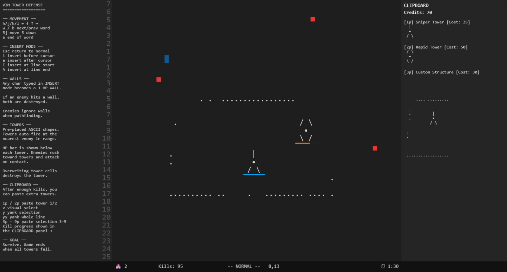

# Vim Tower Defense

Vim Tower Defense is a specialized strategy game where the battlefield is a functional Vim-like text editor. Players must utilize authentic Vim motions, operators, and modes to navigate the environment, construct defenses, and survive endless waves of incoming enemies.

## Core Concept

In Vim Tower Defense, the text buffer is not just a display—it is the physical arena. Every character in the buffer can represent a wall, a component of a tower, or open space. The game bridges the gap between text editing mastery and strategic tower defense gameplay.

The player's efficiency is directly tied to their fluency with Vim commands. Faster navigation leads to faster response times, and a deeper understanding of operators allows for more complex battlefield manipulation.

## Gameplay Mechanics

### Navigation and Interaction
The player controls a standard Vim cursor. Movement is handled through traditional keys like `h`, `j`, `k`, `l`, as well as more advanced word-jumps (`w`, `b`, `e`) and line-anchors (`0`, `$`). The engine supports numeric counts (e.g., `10j`), allowing for rapid traversal of the grid.

### The Construction System
Construction is divided into two primary categories:

1.  **Improvised Walls**: By entering Insert Mode (`i`, `a`, `I`, `A`), the player can type directly into the buffer. Every character typed becomes a "Wall" with 1 HP. These structures are ideal for quick, low-cost blocking and diverting enemy paths.
2.  **Specialized Towers**: Using the Yank (`y`) and Paste (`p`) mechanism, players can deploy pre-configured ASCII structures. These towers possess various stats such as range, rate of fire, and damage.

### Economy and Progression
The game features a global Credit system.
- **Earning**: Every enemy defeated grants exactly 1 Credit.
- **Spending**: Pasting a specialized tower deductions a set amount of Credits from the global pool. Unlike early versions of the game, pasting one item does not reset the progress of others; it simply subtracts from the shared balance.

### Hybrid Difficulty Scaling
To ensure a balanced experience, the game employs a non-linear difficulty curve:
- **Early Game**: A square-root time component ensures the game starts quickly, avoiding a slow or boring introduction.
- **Mid-to-Late Game**: Difficulty scaling transitions to a hybrid model based on both total survival time and total kill count. This rewards high-efficiency play while ensuring the challenge keeps pace with the player's expansion.

## Control Reference

### Normal Mode Navigation
| Command | Action |
|:---|:---|
| **h / j / k / l** | Move cursor one cell Left, Down, Up, or Right. |
| **w / b / e** | Jump to the start of the next word, previous word, or end of the current word. |
| **0 / $** | Jump directly to the beginning or end of the current line. |
| **[count] + motion** | Repeat a motion N times (e.g., `5j` to move 5 lines down). |

### Operators and Actions
| Command | Action |
|:---|:---|
| **v** | Enter Visual Mode to select patterns. |
| **y / yy** | Yank (copy) the current selection or the whole line into the clipboard. |
| **p / [count]p** | Paste from the clipboard slot N (e.g., `1p` for tower slot 1, `2p` for 2). |
| **d / dd** | Delete the current selection or line. |
| **c / cc** | Change the current selection or line (deletes and enters Insert Mode). |
| **i / a** | Enter Insert Mode before or after the cursor. |
| **I / A** | Enter Insert Mode at the start or end of the line. |

### Insert Mode
| Command | Action |
|:---|:---|
| **Esc** | Return to Normal Mode. |
| **Any Character** | Places a 1-HP wall at the current cursor location in the buffer. |
| **Backspace** | Deletes the character/structure before the cursor. |

## Technical Architecture

The game is built using the following technologies:

- **Phaser 3**: Utilized for high-performance rendering of the text grid, projectiles, and particle effects.
- **Custom Vim Engine**: A bespoke TypeScript implementation of the Vim state machine, handling mode switching, command parsing, and buffer manipulation.
- **System-Based Design**: The logic is decoupled into specialized systems (e.g., `EnemySystem`, `TowerSystem`, `CombatSystem`) to maintain a clean and extensible codebase.

## Development and Deployment

| Stage | Command | Description |
|:---|:---|:---|
| **Installation** | `npm install` | Installs all necessary project dependencies. |
| **Development** | `npm run dev` | Launches the local server (typically at `http://localhost:8080`). |
| **Build** | `npm run build` | Generates a minified, production-ready bundle in the `dist/` directory. |

---
**Maintained by Yash Bhansari and Veer Mehta.**
